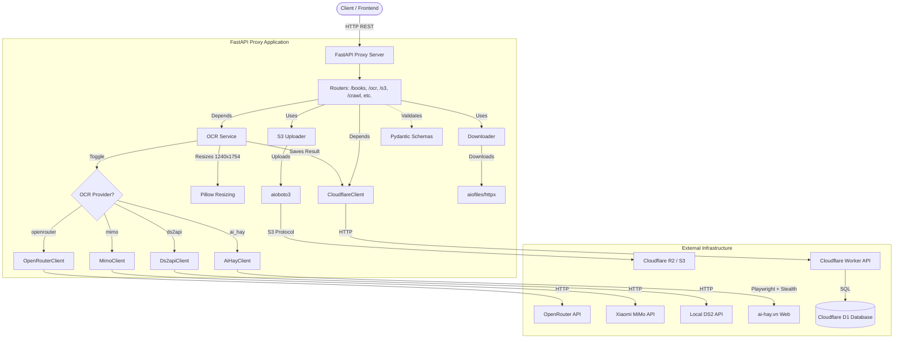

# AGENTS.md

## Project Overview
This project (`backup_sgk`) is a Python FastAPI proxy service acting as a backend intermediary for the SGKViet Cloudflare Worker API. It handles complex operations like batch OCR processing, image downloading, and S3/R2 uploads, utilizing `httpx` for asynchronous HTTP requests and `pydantic` for data validation.

---

## 1. Build and Run Commands

- **Dependency Management**: Uses `uv`.
- **Install Dependencies**: `uv sync` or `uv pip install -r pyproject.toml`
- **Run Development Server**: 
  ```bash
  # Standard
  uv run uvicorn app.main:app --reload
  
  # Windows (Required for Playwright/Subprocesses)
  uv run python run.py
  ```
- **Tests/Linting**: Currently no test framework (e.g., `pytest`) or linter (e.g., `ruff`) is explicitly configured in `pyproject.toml`. It is recommended to use `ruff check .` for linting if `ruff` is installed.
- **Experimental Features**: Enhanced Playwright-based OCR (`ai-hay.vn`) integration is available in `app/utils/ai_hay_client.py`. It includes advanced antibot measures (stealth, UA rotation, CDP overrides) and session persistence. Legacy Bing/Copilot scripts are in the `scratch/` directory.

---

## 2. Architecture & Structure

### Core Components
- **`app/main.py`**: The entry point for the FastAPI application. Sets up CORS, lifespan hooks, and custom OpenAPI schema.
- **`app/api/routers/`**: Contains endpoint definitions.
  - `books.py`: Books proxy endpoints.
  - `book_pages.py`: Book pages proxy endpoints.
  - `configs.py`: Configs proxy endpoints.
  - `ocr.py`: OCR process and failure endpoints.
  - `crawl.py`: Crawler trigger proxy endpoints.
  - `s3.py`: Endpoints for uploading book images to S3/R2.
- **`app/services/`**: 
  - `cloudflare_client.py`: Async HTTP wrapper for communication with the Cloudflare Worker API.
  - `ocr_service.py`: Orchestrates OCR workflows, including image resizing and provider selection.
  - `s3_uploader.py`: Handles batch uploading of local images to Cloudflare R2/S3 using `aioboto3`.
  - `downloader.py`: Asynchronously downloads book page images from URLs to the local `download/` directory.
- **`app/schemas/`**: 
  - `cloudflare.py`: Pydantic models for request/response validation.
- **`app/utils/`**:
  - `openrouter_client.py`: Client for OpenRouter AI vision models.
  - `mimo_client.py`: Client for Xiaomi MiMo AI vision models.
  - `ds2api_client.py`: Client for local DS2 API agents.
  - `ai_hay_client.py`: Browser-automation client for ai-hay.vn OCR.

### Storage
- **Local**: Images are temporarily stored in `download/` during processing.
- **Remote (D1)**: Metadata and OCR results are persisted in Cloudflare D1 via the Worker API.
- **Remote (R2/S3)**: Processed images can be uploaded to Cloudflare R2 or any S3-compatible storage.

---

## 3. Code Style & Conventions

- **Typing**: Strict type hints (`typing.List`, `typing.Optional`) are required for all function signatures and Pydantic models.
- **Async Patterns**: High concurrency is maintained using `async`/`await`. Avoid blocking I/O; use `aiofiles` for file operations and `httpx` for network requests.
- **Dependency Injection**: FastAPI's `Depends` is used for injecting service instances (`CloudflareClient`, `OCRService`).
- **Environment Variables**: Managed via `.env`. Ensure sensitive keys (API tokens, S3 credentials) are never hardcoded.
- **Image Processing**: OCR workflows include a resizing step to **1240x1754** (A4 ratio) using `Pillow` (LANCZOS resampling) to optimize for vision models.

---

## 4. Architecture Workflow Diagram



