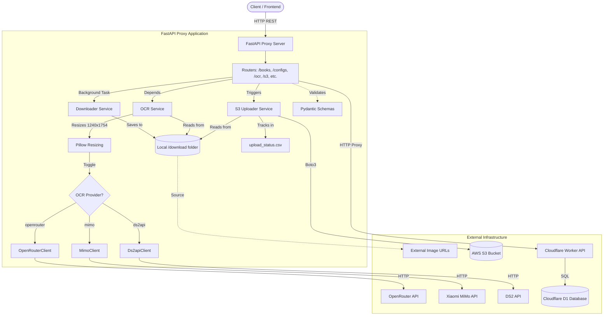

# AGENTS.md

## Project Overview
This project (`backup_sgk`) is a Python FastAPI proxy service acting as a backend intermediary for the SGKViet Cloudflare Worker API. It utilizes `httpx` for asynchronous HTTP requests to the worker and `pydantic` for data validation, exposing a unified Swagger documentation.

---

## 1. Build and Run Commands

- **Dependency Management**: Uses `uv`.
- **Install Dependencies**: `uv sync` or `uv pip install -r pyproject.toml`
- **Run Development Server**: 
  ```bash
  uv run uvicorn app.main:app --reload
  ```
- **Tests/Linting**: Currently no test framework (e.g., `pytest`) or linter (e.g., `ruff`) is explicitly configured in `pyproject.toml`. It is recommended to use `ruff check .` for linting if `ruff` is installed.

---

## 2. Architecture & Structure

### Core Components
- **`app/main.py`**: The entry point for the FastAPI application. Sets up CORS, lifespan hooks, and dynamic Swagger UI configuration.
- **`app/api/routers/`**: Contains endpoint definitions, passing requests to the client service.
  - `books.py`: Books proxy endpoints, including background image downloading.
  - `book_pages.py`: Book pages proxy endpoints.
  - `configs.py`: Configs proxy endpoints, including `findByKey`.
  - `ocr.py`: OCR processes and fails proxy endpoints, and batch processing triggers.
  - `crawl.py`: Crawler trigger proxy endpoints.
  - `s3.py`: Endpoints for uploading downloaded images to S3.
- **`app/services/`**:
  - `cloudflare_client.py`: An asynchronous HTTP wrapper (`CloudflareClient`) using `httpx` to handle all communication with the remote Cloudflare Worker API.
  - `ocr_service.py`: Orchestrates the OCR pipeline, including image encoding, provider selection, and result persistence.
  - `downloader.py`: Handles asynchronous background downloading of book images from external URLs.
  - `s3_uploader.py`: Manages uploading local images to AWS S3 with status tracking via CSV.
- **`app/schemas/`**: 
  - `cloudflare.py`: Pydantic models mapping directly to the Cloudflare Worker OpenAPI schema (e.g., `Book`, `Config`, `OcrProcess`).
- **`app/utils/`**:
  - `openrouter_client.py`: Client for OpenRouter AI vision models.
  - `mimo_client.py`: Client for Xiaomi MiMo AI vision models.
  - `ds2api_client.py`: Client for DS2 API vision models.


### Database
This project **does not** manage a direct database connection. All data persistence is managed remotely via the Cloudflare Worker's D1 database.

---

## 3. Code Style & Conventions

- **Typing**: Strict type hints (`typing.List`, `typing.Optional`) are expected across all function signatures and Pydantic models.
- **Async Patterns**: Endpoints and the HTTP client must use `async`/`await`. Avoid blocking synchronous I/O operations.
- **Dependency Injection**: FastAPI's `Depends` is used to inject service instances into the route handlers.
- **Environment Variables**: Managed via `python-dotenv` and the `.env` file. Ensure all sensitive data relies on `os.getenv`.
- **Pydantic**: Use `BaseModel` for validation and schema definition. Responses should rigorously use `response_model` decorators.
- **Image Processing**: Image-to-markdown OCR includes an automated resizing step (**1240x1754**) using `Pillow` before processing.
- **Error Handling**: `OCRService` implements a global lock to prevent rate limits (429) and uses exponential backoff for retries.

---

## 4. Architecture Workflow Diagram


